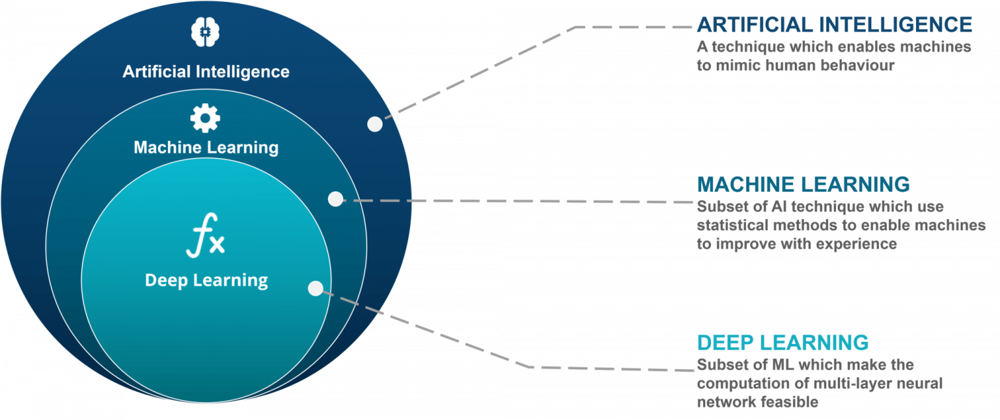

 

  

<h3 align="center">Pertemuan Pertama Asistensi AI</h1>

  
   
  <a href="https://github.com/ekodavidkurnia/AI-Assistant-Lecturer-2021/issues/new?template=bug_report.md">Report bug</a>
  ·
  <a href="https://github.com/ekodavidkurnia/AI-Assistant-Lecturer-2021/issues/new?template=feature_request.md">Request feature</a>
  ·

<!-- TABLE OF CONTENTS -->

  
<h2 style="display: inline-block">Table of Contents</h2>

  <ol>
    <li><a href="#how-to-approach-learning-ML/DL">How to approach learning ML/DL</a></li>
    <li><a href="#quick-start">Quick Start</a></li>
    <li><a href="#class-note">Class Note</a></li>
    <li><a href="#live-class-video">Live Class Video</a></li>
    <li><a href="#creators">Creators</a></li>
    <li><a href="#copyright-and-license">Copyright and License</a></li>
  </ol>

## How to approach learning ML/DL

How to approach learning ML/DL

- write code ('if in doubt, run the code')
- explore & experiment 
- ask questions (including the 'dumb' ones, you will get very smart if you ask lots of 'dumb' question) 
- Do the exercises (this course doesnt cover anything)
- share your work (make github, medium etc)
- Avoid overthinking ('I cant learn it' mentality is bullsh*t)

  

## Quick Start

Several quick start options are available:

- [Download the latest release](https://github.com/ekodavidkurnia/AI-Assistant-Lecturer-2021/archive/refs/heads/main.zip)
- Clone the repo: `git clone https://github.com/ekodavidkurnia/AI-Assistant-Lecturer-2021.git`

Read the [scikit learn](https://scikit-learn.org/stable/) and [tensorflow](https://www.tensorflow.org/resources/learn-ml) for the basic understanding.

## Class Note

  

 

  

## Live Class Video

You can access the video from [this link](https://youtu.be/qAcFMD0aeC8)

## Creators

|         Name         | Student ID |        Major        |  Contacts                |
| :--------------------: | :--------: | :----------------: |  :--------------------------------------------------------------------------------------------------------: |
|  Eko David Kurniawan   |  17415119TK46408  |   Engineering Physics   |   [![david-github][github-shield]][david-github-url][![david-linkedin][linkedin-shield]][david-linkedin-url] |

## Copyright and license

Code and documentation copyright 2021 by [Authors](https://github.com/ekodavidkurnia/AI-Assistant-Lecturer-2021/graphs/contributors).

<!-- MARKDOWN LINKS & IMAGES -->
<!-- https://www.markdownguide.org/basic-syntax/#reference-style-links -->
<!-- Github Link -->

[github-shield]: https://img.shields.io/badge/GitHub--brightgreen?style=social&logo=Github
[david-github-url]: https://github.com/ekodavidkurnia

<!-- LinkedIn Link -->

[linkedin-shield]: https://img.shields.io/badge/LinkedIn--brightgreen?style=social&logo=Linkedin
[david-linkedin-url]: https://www.linkedin.com/in/eko-david-kurniawan/

